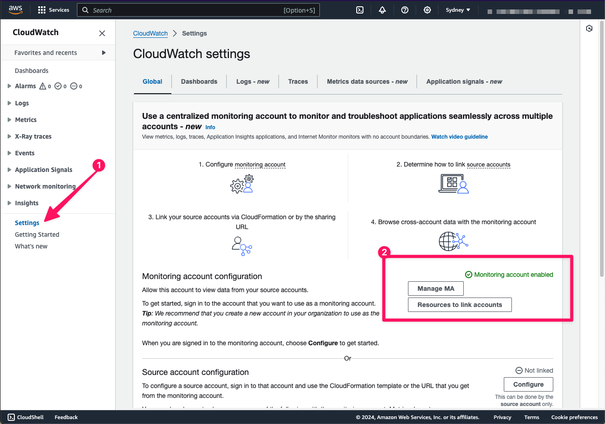
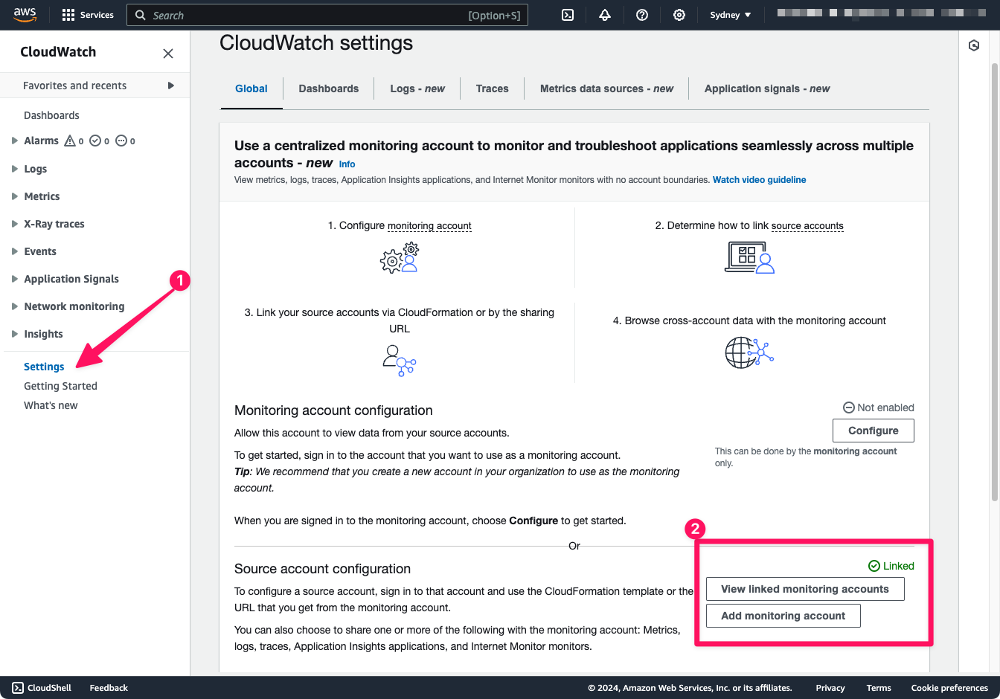
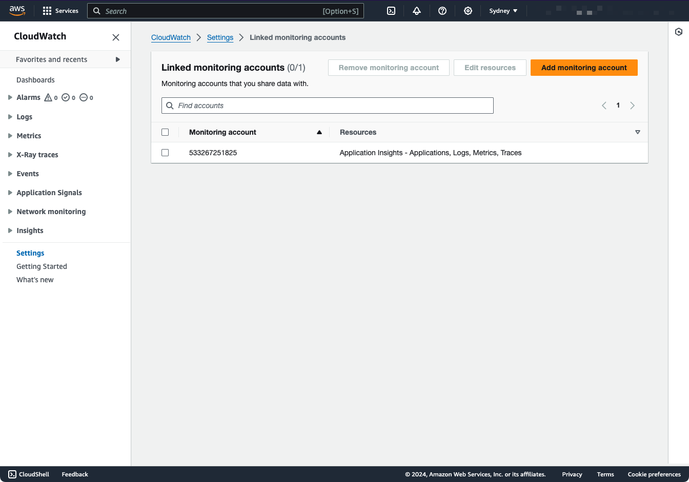

# How to configure CloudWatch Observability Access Manager (OAM)

CloudWatch OAM empowers you to centralize and connect a region in multiple accounts (named Source accounts) into the same region in a destination account (named Monitoring account).

For example:

- Source account A us-east-1 => Monitoring account us-east-1
- Source account B us-east-1 => Monitoring account us-east-1

Using the CloudWatch dashboard in Monitoring account us-east-1, you can see logs, metrics, trances and insights from Source accounts A and B.

- Source account A ap-southeast-2 => Monitoring account ap-southeast-2
- Source account B ap-southeast-2 => Monitoring account ap-southeast-2

Using the CloudWatch dashboard in Monitoring account ap-southeast-2, you can see logs, metrics, trances and insights from Source accounts A and B.

## CloudWatch OAM Constructs

You work with 3 (three) components when configuring CloudWatch OAM:

- **Sink**: A Sink represents a destination point where AWS accounts running workloads (named Source accounts) will send their logs, metrics, trace and insights to. You create Sinks in the Monitoring account. You can create a single Sink per region in the Monitoring account. A Monitoring account can be connected to as many as 100,000 Source accounts.

- **Link**: A Link represents the connection between the Source account (AWS accounts running workloads) and the Monitoring account (the destination point). You create a Link in the AWS accounts running workloads where logs, metrics trace and insights are created. You can create multiple Links per region in the Source account, they must point and connect to a different Sink ARN. A Source account can be paired with up to 5 (five) monitoring accounts concurrently.

- **Sink Policy**: A Sink Policy is similar to [Resource-based Policies](https://docs.aws.amazon.com/IAM/latest/UserGuide/access_policies_identity-vs-resource.html). A Sink Policy grants permissions to Source accounts to connect their Links to the Monitoring account Sink. When you create a Sink Policy, you can grant permissions to all accounts in an AWS Organizations or to individual accounts via AWS Account Id. You can also use the Sink Policy to limit the types of data that is shared. The 4 (four) types that you can allow or deny are:
  - **Metrics**: Links in Source accounts can send [CloudWatch Metrics](https://docs.aws.amazon.com/AmazonCloudWatch/latest/monitoring/working_with_metrics.html) to the Sink in the Monitoring account, enable it by adding the **AWS::CloudWatch::Metric** type to your Sink Policy.
  - **Log Groups**: Links in Source accounts can send [CloudWatch Logs](https://docs.aws.amazon.com/AmazonCloudWatch/latest/logs/WhatIsCloudWatchLogs.html) to the Sink in the Monitoring account, enable it by adding the **AWS::Logs::LogGroup** type to your Sink Policy.
  - **Traces**: Links in Source accounts can send [AWS X-Ray Traces](https://docs.aws.amazon.com/xray/latest/devguide/aws-xray.html) to the Sink in the Monitoring account, enable it by adding the **AWS::XRay::Trace** type to your Sink Policy.
  - **Application Insights - Applications**: - Links in Source accounts can send [CloudWatch Application Insights](https://docs.aws.amazon.com/AmazonCloudWatch/latest/monitoring/cloudwatch-application-insights.html) to the Sink in the Monitoring account, enable it by adding the **AWS::ApplicationInsights::Application** type to your Sink Policy.

## The example in this repository

This repository shows how to configure [CloudWatch Observability Access Manager (OAM)](https://docs.aws.amazon.com/OAM/latest/APIReference/Welcome.html) for multi-account logs, metrics, traces and insights.

We'll use the example described in the introduction above for our technical implementation. We are going to connect two regions from two Source accounts into the Monitoring account.

## Final results

After deploying this example, you can generate logs, metrics, traces and insights in the Source accounts and they will be available for analysis and visualization in the Monitoring account.

In the Monitoring account CloudWatch Logs dashboard in us-east-1, I can see logs from both Source accounts:

In the Monitoring account CloudWatch Logs dashboard in ap-southeast-2, I can see logs from both Source accounts:

In the Monitoring account CloudWatch Logs dashboard in us-east-1, I can use Log Insights to query log groups from both Source accounts and inspect my log events:

## How to find OAM Sink and Link in CloudWatch dashboard?

You can find OAM Sink and Link configuration by clicking on "Settings" in the sidebar on the CloudWatch regional dashboard:

- Link to us-east-1 regional dashboard: https://console.aws.amazon.com/cloudwatch/home?region=us-east-1
- Link to ap-southeast-2 regional dashboard: https://console.aws.amazon.com/cloudwatch/home?region=us-east-1

In the Monitoring account, you will see the "Monitoring account enabled" enable status and buttons to inspect the configuration of the Sink, connected Links and manual steps to connect Links (which we didn't used! We are using Terraform for the configuration).

However, in the Source account, you will see the "Linked" enable status and buttons to view the linked monitoring accounts and to connect manually to one (which we didn't used! We are using Terraform for the configuration).

